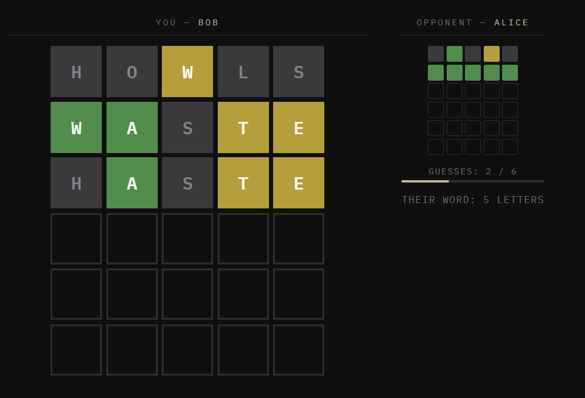

# Wordle Duel

A real-time, two-player Wordle game where you choose the word your opponent must solve and they choose yours.

Both players compete simultaneously. The player to correctly guess their opponent’s word wins.

## Live Demo

**Play Wordle Duel: **wordlevs.swikrut.com

## How It Works

1. One player creates a room and receives a custom room code.
2. The second player joins using the room code.
3. Each player secretly selects a  word for their opponent.
4. Once both words are locked in, the game begins.
5. Both players have up to six attempts to solve their assigned word.
6. The player to guess the word correctly wins.

## Features

* Real-time 1v1 multiplayer gameplay
* Private rooms with shareable room codes
* Classic six-guess Wordle rules
* Color-coded letter feedback
* Live opponent progress
* In-game chat
* Rematch system
* Mobile-friendly responsive design

## Wordle Feedback

* 🟩 **Green:** Correct letter in the correct position
* 🟨 **Yellow:** Correct letter in the wrong position
* ⬛ **Gray:** Letter is not in the word

Repeated letters are evaluated according to the number of times they appear in the target word.

## Word Validation

Chosen words and guesses are validated using an English-language dictionary derived from the [`dwyl/english-words`](https://github.com/dwyl/english-words) project.

## Built With

* Node.js
* Express
* Socket.io
* HTML
* CSS
* JavaScript
* Docker

## Screenshots

  

## About the Project

Wordle Duel combines classic Wordle gameplay with real-time multiplayer competition.

Unlike traditional Wordle, each player chooses the challenge for their opponent. Live progress tracking and in-game chat make every round more competitive and interactive.

## License

This project is intended for personal and portfolio use.
